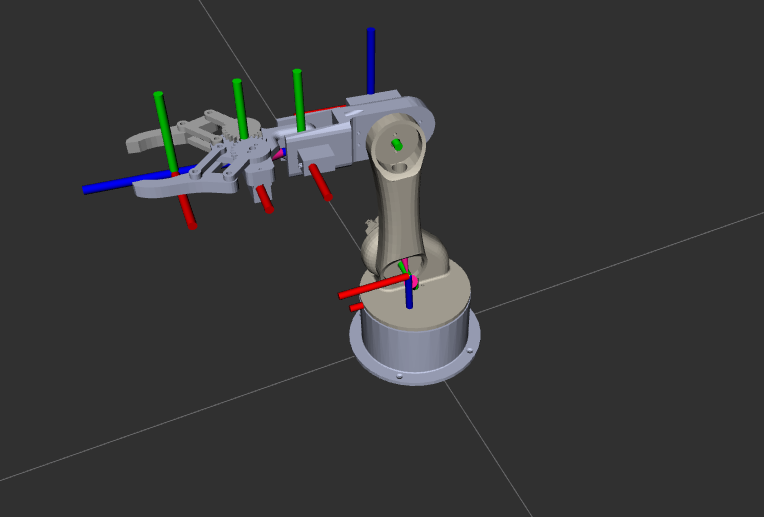
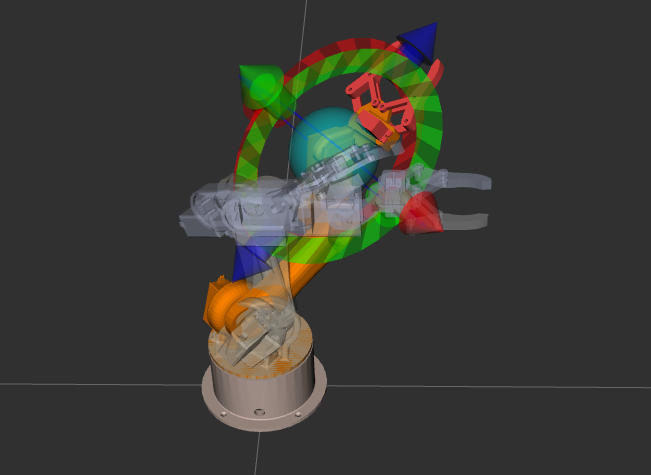
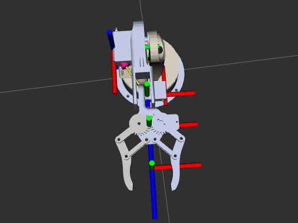

# MoveIt 2 Configuration Documentation

## Overview

This package provides the MoveIt 2 configuration for a custom 4-DOF robotic arm with a two-finger parallel gripper.

MoveIt is responsible for:

- Motion Planning
- Inverse Kinematics
- Collision Checking
- Cartesian Path Generation
- Trajectory Execution
- End Effector Control

---

# Robot Model

<p align="center">
  
</p>

The robot consists of:

- 4 revolute arm joints
- 2 gripper joints
- 1 TCP (Tool Center Point)

---

# Coordinate Frames

The robot planning chain is:

```text
world
  └── base_link
        └── link_1
              └── link_2
                    └── link_3
                          └── link_4
                                └── tcp_link
```

---

# Planning Groups

MoveIt uses planning groups to determine which joints should be planned together.

<p align="center">
  
</p>

---

## Arm Group

Base Link:

```text
base_link
```

Tip Link:

```text
tcp_link
```

Joints:

```text
joint_1
joint_2
joint_3
joint_4
```

Purpose:

- Positioning
- Trajectory Planning
- Cartesian Motion

---

## Gripper Group

Joints:

```text
joint_5
joint_6
```

Purpose:

- Open Gripper
- Close Gripper
- Grasp Objects

---

# End Effector

The gripper is defined as an end effector attached to the arm.

```xml
<end_effector
    name="gripper"
    parent_link="link_4"
    group="gripper"
    parent_group="arm"/>
```

This allows MoveIt to understand the relationship between the manipulator and the gripper.

---

# Motion Planning Pipeline

<p align="center">
  
</p>

Planning pipeline:

```text
Goal Pose
     ↓
Inverse Kinematics
     ↓
Collision Checking
     ↓
OMPL Planner
     ↓
Trajectory Generation
     ↓
Execution
```

---

# Kinematics

This robot uses:

```text
KDLKinematicsPlugin
```

Configuration:

```yaml
kinematics_solver_search_resolution: 0.005
kinematics_solver_timeout: 0.05
```

Purpose:

- Solve inverse kinematics
- Convert poses into joint angles

---

# Collision Checking

MoveIt performs:

- Self Collision Checking
- Environment Collision Checking
- Trajectory Validation

A self-collision matrix was generated using MoveIt Setup Assistant.

Disabled collision pairs include:

```text
base_link ↔ link_1
link_1 ↔ link_2
link_2 ↔ link_3
link_3 ↔ link_4
link_4 ↔ link_5
link_4 ↔ link_6
link_5 ↔ link_6
```

These pairs are adjacent and cannot produce meaningful collisions.

---

# Named States

## Home

```yaml
joint_1: 0
joint_2: 0
joint_3: 0
joint_4: 0
```

---

## Gripper Open

```yaml
joint_5: 0.425
joint_6: -0.425
```

---

## Gripper Closed

```yaml
joint_5: 0
joint_6: 0
```

---

# Cartesian Path Planning

<p align="center">
  
</p>

MoveIt can generate linear end-effector motion.

Applications:

- Pick and Place
- Object Manipulation
- Camera Positioning

Example:

```text
Move Above Object
        ↓
Move Down
        ↓
Close Gripper
        ↓
Lift Object
```

---

# Gripper Control

<p align="center">
  
</p>

The gripper is controlled through the dedicated planning group.

Commands:

```text
Open
Close
Partial Close
```

---

# Launch Files

## demo.launch.py

Launches:

- RViz
- Move Group
- Robot State Publisher
- ros2_control

Usage:

```bash
ros2 launch robotic_arm_moveit_config demo.launch.py
```

---

## move_group.launch.py

Starts only:

```text
Move Group Node
```

Usage:

```bash
ros2 launch robotic_arm_moveit_config move_group.launch.py
```

---

## moveit_rviz.launch.py

Starts RViz with MoveIt configuration.

Usage:

```bash
ros2 launch robotic_arm_moveit_config moveit_rviz.launch.py
```

---

## rsp.launch.py

Starts:

```text
Robot State Publisher
```

Usage:

```bash
ros2 launch robotic_arm_moveit_config rsp.launch.py
```

---

# Testing Procedure

1. Launch MoveIt

```bash
ros2 launch robotic_arm_moveit_config demo.launch.py
```

2. Select:

```text
Planning Group → arm
```

3. Move the interactive marker.

4. Click:

```text
Plan
```

5. Verify collision-free trajectory.

6. Click:

```text
Execute
```

7. Verify robot movement.

---

# Current Status

Completed:

- URDF Integration
- MoveIt Setup Assistant
- Kinematics Configuration
- Collision Matrix Generation
- Motion Planning
- Gripper Planning
- Cartesian Planning
- Trajectory Execution

Next Steps:

- Gazebo Simulation
- Camera Integration
- Pick-and-Place Pipeline
- Hardware Integration